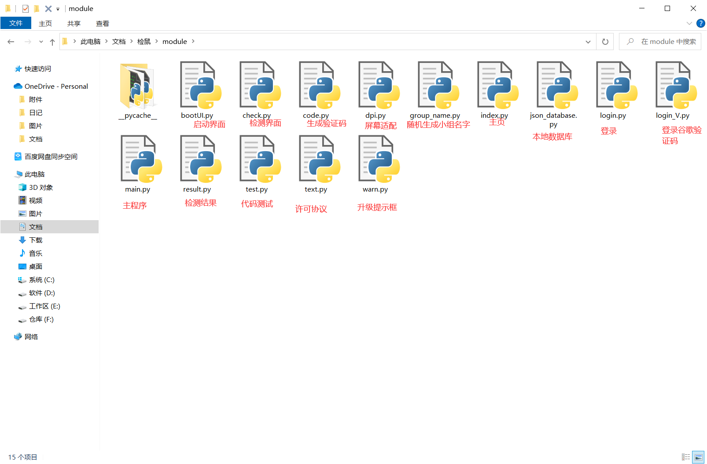
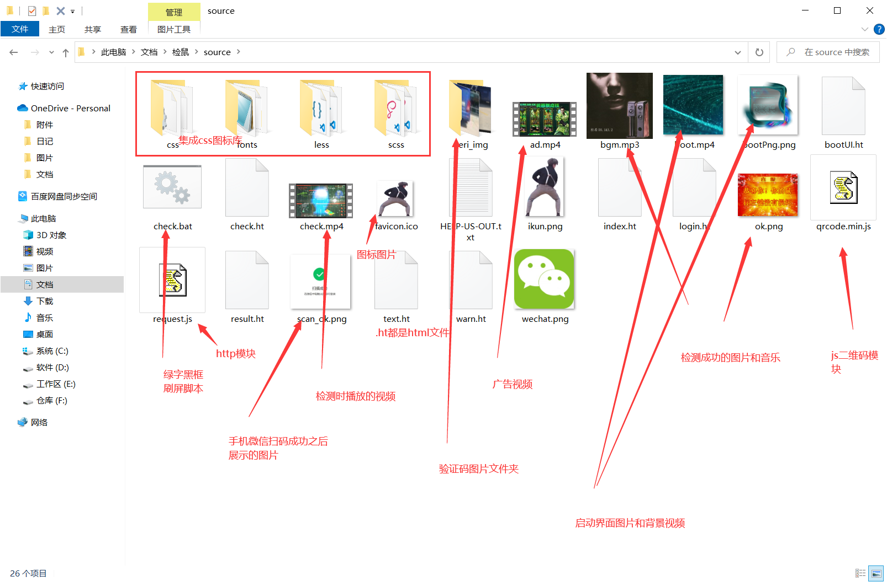
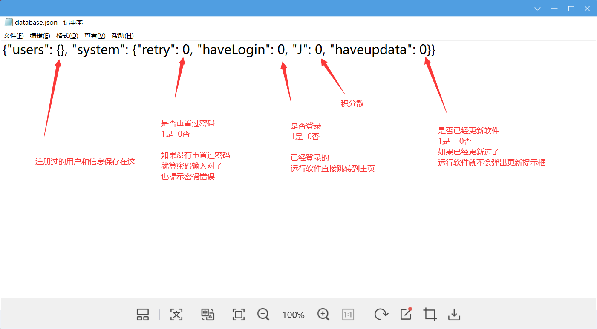

# 检鼠
## 注意！这是一个完全由编程新手实现的有趣的小软件选修课作业。我不建议你从它当中学习我们的编程习惯，这里面有非常多的代码是不适合用在生产环境的。例如服务器的安全验证、验证码的实现逻辑等等。我们为了偷懒在很多地方都使用了非常规手段。比起实际生产，这个项目更多倾向于“表演”。对于来自母语为非中文的朋友，我们没有能力写出通顺且符合语法的英语，继续阅读请使用翻译器。
# CheckMouse
## Attention! This is an interesting elective course assignment for small software that is completely implemented by beginners in programming. I don't recommend that you learn our programming habits from it, as there is a lot of code that is not suitable for use in production environments. For example, security verification of servers, implementation logic of verification codes, and so on. We have used unconventional methods in many places to be lazy. Compared to actual production, this project leans more towards "performance".For friends whose native language is not Chinese, we do not have the ability to write fluent and grammatical English. Please use a translator to continue reading.


# 1、配置运行
## 1.1、服务器端(server)
### 1.1.1、文件夹树
你可以看到服务器端的文件夹关系是这样的  
├─public  
│  └─img  
└─server
### 1.1.2、环境
你需要有nodejs环境并且安装该项目需要的模块  
安装nodejs和npm之后  
在根目录下执行```npm install```即可安装对应模块
### 1.1.3、配置邮箱
在./server/sendMail.js内
第12行和第13行
```
mymail="xxxx@xxx.com";//邮箱
mymailkey='xxxxxxxxxxx';//IMAP/SMTP服务授权码
```
把xxxx@xxx.com改为自己的邮箱  
把xxxxxxxxxxx改为邮箱对应的IMAP/SMTP服务授权码  
这样服务器才能发送邮箱验证码
### 1.1.4、运行
在根目录下执行```node main.js```
## 1.2、客户端(client)
### 1.2.1、文件夹树
你可以看到客户端的文件夹关系是这样的  
├─module  
└─source  
    ├─css  
    ├─fonts  
    ├─less  
    ├─scss  
    └─veri_img  
### 1.2.2、环境
你需要有python3环境并且安装该项目需要的模块  
要求的模块  
pywebview  
pywin32
安装python3之后
在根目录执行```pip install -r requirements.txt```即可安装对应模块
### 1.2.3、配置后端服务器地址
在根目录下的database.json文件中  
```{"url": "127.0.0.1", "users": {}, "system": {"retry": 0, "haveLogin": 0, "J": 0, "haveupdata": 0}}```  
请将"url":后面的127.0.0.1替换为自己部署好后端的服务器地址  
请不要加上协议和端口号  
例如http、:8081
### 1.2.4、运行
双击打开根目录下的  
```检鼠.exe```  
或者  
```检鼠无控制台.exe```  
即可运行
# 2、其他补充内容
## 2.1、module目录下各模块功能

## 2.2、source目录下各资源功能

.ht后缀的文件其实就是html，后缀改为.ht是为了避免直接双击使用浏览器打开。  
如果你需要修改的话请在编辑器内使用html标准打开ht文件。
## 2.2、根目录下database.json各键的功能

另外还增加了一个键url，用于配置后端域名